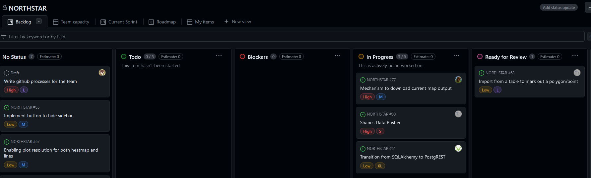

# Purpose
The aim of this repo is to show react unit testing and implement github actions for react testing

# Workflow
1. Find bug/Ideate Feature
2. Create issue ([Example](https://docs.google.com/presentation/d/1AMIjRKvngZaCPG4n730DW3tb3MN2tQZYmi-2A_v55RA/edit#slide=id.g2c002906693_0_329))
    - Title
    - Description
    - User Story (For features)
    - Acceptance Criteria
3. Assign labels
    - Feature/Bug
    - Backend/API/Frontend
4. Assign to Project 
https://github.com/orgs/STARLAKE-LAKERS/projects/1/views/1

    - No Status
    - Todo
    - Blockers
    - In Progress
    - Ready for review
    - Done
5. Seperate branch
    - Branch name: fix/{{Title}} or feat/{{Title}}
6. Code!
7. Commit using this convention ([Example](https://docs.google.com/presentation/d/1AMIjRKvngZaCPG4n730DW3tb3MN2tQZYmi-2A_v55RA/edit#slide=id.g26b020f8e9f_0_5))
8. Create Pull Request
    - Use this convention ([Example](https://docs.google.com/presentation/d/1AMIjRKvngZaCPG4n730DW3tb3MN2tQZYmi-2A_v55RA/edit#slide=id.g26b020f8e9f_0_35))
9. Close issues after approval

# Git Branches
https://docs.google.com/presentation/d/1AMIjRKvngZaCPG4n730DW3tb3MN2tQZYmi-2A_v55RA/edit#slide=id.g2c002906693_0_491

How do we enforce this? Manually is not sustainable so we use Github Actions!
